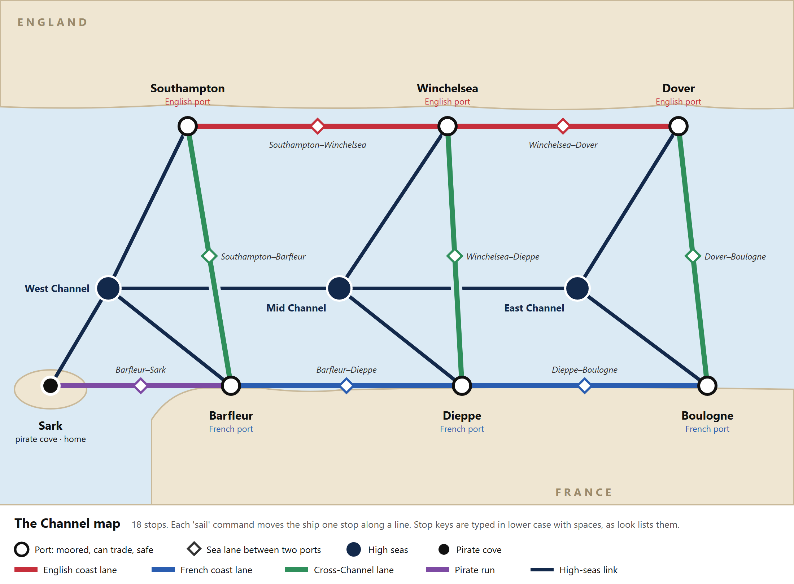

# Eustace the Pirate Monk

Design Document - CS 2114 Project 1, Group 87

---

## 1. What are you building?

What are you building? One paragraph a non-CS person could understand. Challenge yourself to describe it without technical terms but while still being complete. Try to think of something with a fun spin on it. For example, don't just make "a flashcard app". Make "a flashcard app that strategically gives you a mix of things you've gotten right before and things you tend to get wrong".

You play a pirate captain sailing around the English Channel between England and France. You give
orders to your men or make decisions by typing them and the game responds and describes the world around you as well as your context (specifically in combat) in words. You sail from port to port, English, French, and pirate coves,
and you choose where to go next and what to do when you get there. You can also spend time in the ocean or channel but your ship attritions as you do and you may get attacked by other pirates and the coast guard. Your power is measured by the ship and your crew: crew members die or dessert, the ship's armour wears down, and ammunitions runs low. You can raid different kinds of ships to get more or less loot, as well as more or less notoriety (which determiens the difficulty of the game: how big hostile ships are, how common they are, etc.)

---

state machine

## 2. What is the MVP?

MVP (Minimum Viable Product) - Considering what core functionality is absolutely necessary to solve the user's primary problem. The smallest version that actually works. Take your description and transform it into a set of features your product should have. Consider what functional requirements (what your program must do) and non-functional requirements (how your program must perform) are a good fit for your project. Ensure your features are specific components or actions (e.g., add card, add deck) rather than very high level descriptions of collections of features (e.g., manages deck). 

MVP: a survival adventure game. You try to be the biggest pirate in the channel without being killed by the coast guard or other pirates or arrested in shore. 

### Functional requirements - what the program must do

1. Running the program starts a voyage: the game prints the opening scene, puts the ship at its home cove, and sets hull, crew, cannons, armour, rum and gold to their starting values.
2. Typing 'look' describes the current stop on the Channel map, so the game prints its name and kind, whether it is English, French or a pirate cove, what can be bought there when it is a port, and every stop one move away.
3. Typing 'status' checks the ship, which prints hull health, crew count, crew morale and greed, cannon and armour levels, bottles of rum in the hold, gold and notoriety.
4. Typing 'sail <stop>' moves the ship one stop along the Channel map when that stop is joined to the current one, describing the new stop and, when it is at sea, rolling for one encounter, and when the stop is not joined to the current one or is misspelled it names the neighbouring stops and spends no turn.
5. Typing 'repair <amount>' at a port buys hull back at the port's price per point, stopping at full hull or at the gold the player holds and reporting how many points were bought.
6. Typing 'hire <count>' at a port adds that many crew at the port's price each, refusing the portion the player cannot pay for and saying how many came aboard.
7. Typing 'buy cannons' or 'buy armour' at a port raises that level by one, up to the maximum level, charging the price of the next level and reporting the old level beside the new one. Typing 'buy rum <bottles>' adds that many bottles to the hold at the port's price each, stopping at the gold the player holds and reporting how many came aboard.
8. Typing 'fight' during an encounter resolves the battle in rounds, where damage dealt comes from the cannons and the surviving crew, scaled by that crew's morale, and damage taken is reduced by armour before it lands on hull and crew, until one side is out of the fight.
9. Typing 'flee' during an encounter breaks it off, applying parting damage to the hull and giving no plunder.
10. Winning a fight takes plunder, so the game adds the defeated ship's gold to the player's, gives the amount, and returns the player to sailing.
11. Letting hull or crew reach zero sinks the ship, and the game prints how it was lost and the final gold total before ending.
12. Typing 'retire' at the home cove while holding at least the target gold wins the run, printing the ending, the gold total and the number of ports visited.
13. Typing 'help' prints every command with its arguments. 
14. Typing 'quit' asks for confirmation and exits without saving.
15. Typing 'bonus <amount>' hands that much gold to the crew, lowering greed by an amount set by the gold each man receives and raising morale.
16. Every move into a sea stop, the crew drinks one bottle of rum per ten men; every bottle it wanted and the hold could not give costs morale. Winning a fight raises morale and raises greed in proportion to the plunder; fleeing lowers morale.
17. When crew morale empties or greed fills, the crew mutinies: the game prints which one broke, the final gold total and the ports visited, and ends the run. An enemy crew whose morale empties surrenders, which wins the fight.

Starting values, prices, encounter chances and the gold target for retirement are
numbers the group still has to pick. They are placeholders until section 5's unknowns
are closed.

### Non-functional requirements - how the program must perform

1. The game runs as a console program on the lab Eclipse setup, reading typed lines and writing text with no window and no dependencies.
2. All randomness comes from one generator the tests can seed.

### The Channel map

The Channel is drawn like a metro map laid over the sea between England and France. Each
stop is a place the ship can be, and one 'sail' command moves the ship to a stop joined
to the current one by a line. There are three kinds of stop:

1. A port, where the ship is moored. It is the only place to repair, hire crew and buy
   cannons, armour and rum, and nothing attacks the ship there. The map has three
   English ports (Southampton, Winchelsea, Dover), three French ports (Barfleur, Dieppe,
   Boulogne) and one pirate cove, Sark, which is the home port.
2. A sea lane, the open water on a direct route between two ports. There are eight: two
   along the English coast, two along the French coast, three across the Channel, and
   one from Barfleur to Sark. Merchant ships use these, and the coast guard patrols them.
3. The high seas, three stretches of open Channel (West, Mid and East) away from any
   route. Each touches the nearest ports and its neighbouring stretch. Pirates hunt here,
   and encounters are most likely.

Crossing from Dover to Boulogne takes two moves: the Dover–Boulogne lane, then Boulogne.
Every move into a sea stop costs the crew rum or morale and can bring an encounter. The
high seas shorten some trips: Southampton to Sark is two moves across the West Channel
against four along the lanes, and those two moves carry the highest encounter chance on
the map.

## 3. Stretch goals

things you'd add if there's time, separated from the MVP. These are the things that take you from "Meets" to "Exceeds".
Note: your TA will evaluate whether these stretch goals are truly non-essential but interesting and innovative features. Do not attempt to subvert this by making overly easy or achievable "exceeds" specifications.

1. Two-crown politics, where the player takes privateering contracts, holds a standing with England and with France that rises and falls with every raid, and is outlawed by whichever crown the player angers past its floor. As the game takes place during the 100 years war, the player will be incentivised to backstab their patron state because their standing can fall to outlaw levels if they raid friendly ships plus random shifts in standing with the crown.
2. Buying an estate with the retirement gold and holding it through yearly tax demands and raids, this adds a farming mechanic that feels like a retirement but can also be rest from the action and a means to peacefully gather wealth (possibly to return to piracy). Raids and taxation incentivise the player to turn to piracy seasonally (mirroring historical piracy). This adds a capitalism spin to the piracy game.

### The politics system in detail

The player is Eustace the Monk, who sold his seamanship to whichever crown paid, held
the Channel Islands for the English, then changed sides and carried a French invasion
fleet against them. The game gives the player the same choice repeatedly.

What the system adds on top of the MVP:

1. England and France each hold an opinion of the player, tracked as a number that
   starts neutral. Sinking a French merchant raises English standing and lowers French
   standing, with the French drop larger than the English rise.

2. An English port offers a commission: sink a named French ship, or escort a named
   convoy, for a stated purse. Taking it and finishing it pays the purse and raises
   English standing. Taking it and then selling the target's position to France pays a
   defection bounty instead, and drops English standing hard.

3. Each crown has a floor. When a standing drops below that crown's floor, it declares
   the player an outlaw: its ports refuse repair, refuse to sell, and refuse to hire
   crew, and its warships attack on sight in its half of the Channel. Outlawed by both
   crowns, the player can only refit at pirate coves, which charge more for hull repair
   and crew than any crown port and carry a smaller stock of weapons and armour.

4. Challenge: finding the trechery-loyalty equilibrium. Players are encouraged to be loyal enough to keep each crown's ports open and treacherous enough to collect defection bounties from the other crown.

5. Standing recovers by paying tribute at that crown's port or by completing crown contracts. Randomness and crown standings being inversely correlated means that even a loyal privateer will see their standing drop and be incentivised to betray.

New commands this adds: 'contracts' to list what the current port is offering, 'accept
<contract>' to take one, 'betray <contract>' to sell it to the other crown, and
'standing' to print where the player sits with each crown.

### The estate phase in detail

In the MVP, 'retire' ends the game. The estate phase turns that ending into a second
act. Once the player'standing and gold is sufficient in either country, the player can choose from a range of choices to buy an estate and become a lord. This turns the sailors into retainers and starts a yearly clock instead of a
port-to-port one. 

Once the estate is bought four challenges appear: standing, pirate raids, enemy naval raids, and taxation. Taxation is determined by crown standing, higher standing means lower taxes. If you successfully use your retainers to fight off the pirate raid, the player gains standing but might lose expensive retainers. If they're greedy and let the pirates raid, they trade off the money the pirates rob and the loss of standing for having saved some gold.  An estate at a pirate cove pays no tax to anyone, and other pirates raid it more often, and both navies also raid it.

Each year the estate draws events against the player's gold and defences. The crown
sends a tax demand: paying it costs gold and maintains standing, while refusing
keeps the gold, lowers standing with that crown, and raises the chance the sheriff
arrives next year with soldiers to seize the land resulting in game over. A raiding party arrives with a strength the player has to meet with static defenses and retainers; beating it costs some retainers, losing it costs a share of the stored gold. Between years, gold can go into walls, into hiring retainers, or into bribing the local officer so tax demands come in lower (with a risk of being caught, resulting in lower standing). Gold left in the strongbox is what a successful raid takes.

The run ends when the player holds the estate through a set number of years, which
prints the final score, or when the estate is lost. Losing it with the ship already
sold ends the game as a pauper.

New commands this adds: 'estates' to list what is for sale and at what price, 'buy
estate <place>' to retire onto it, 'fortify <walls or retainers>' to spend on defence,
'pay tax' and 'refuse tax' when the demand arrives, and 'holdings' to print the
estate's walls, retainers, stored gold and years held.

### Crew morale and greed in detail

The MVP carries a basic version of this (FR15–17): morale and greed as two numbers, one bottle of rum per ten men per move, and 'bonus'. This stretch goal adds what the basic version leaves out: heavier drinking after big wins and losses, warnings before either bar breaks, a hold that caps how much rum the ship carries, and 'crew' as its own report. The crew becomes another party to be satisfied, and failing this results in game over.

Two bars sit beside hull, armour and gold. Morale is how willing the men are to keep
sailing under the captain, and it drains as the voyage goes on. Greed is how large a
share they believe they are owed, and it climbs whenever loot is taken.
Morale emptying and greed filling both result in mutiny.

**What changes the variables**

1. Every leg the ship sails costs morale. Rum in the hold is drunk at a set number of
   bottles per crew member per leg, and a crew that drinks holds morale where it is
   instead of taking the leg's drop. Sailing with an empty hold does not stop the
   voyage, but lowers morale.

2. Taking a large plunder raises the rum the crew drinks on the legs that follow.

3. Taking a large plunder raises greed, scaled to the size of the haul. The men have
   seen what came aboard and want a share of it.

4. Losing a fight raises the rum the crew drinks in the same way a large plunder does.

5. Losing a fight raises greed and lowers morale in the same turn.

**What the player can do about this**

6. 'buy rum <bottles>' at a port fills the hold at that port's price per bottle. Pirate
   coves sell rum cheaper than English or French ports, which gives a cove a use
   beyond hiding from the navy.

7. 'bonus <amount>' hands gold straight to the crew. Greed falls by an amount set by
   the gold each head receives and morale rises. This means having a bigger crew is a free lunch after hiring them.

8. 'crew' prints morale, greed, bottles in the hold and what the men last asked for, the
   way 'status' prints hull and gold.

**Warnings and the ending**

9. Both bars warn before they end the run. Past a set point on either one, the game
   prints a line every trip saying the bar is approaching a critical level.

10. When morale empties or greed fills, the crew takes the ship. The game prints which
    bar broke, the final gold total and the ports visited, and ends the run. 

13. Storage holds a fixed number of bottles and 'buy rum' cannot overstock it.

**The design problem**

14. The run is won by holding gold, and greed climbs with the gold the crew watches
    come aboard, so the win condition and the loss condition feed each other. This needs a equilibrium where getting too rich doesn't always result in game over or the only way to keep playing 
    is to go bankrupt.

New commands this adds: 'buy rum <bottles>' to fill the storage at a port, 'bonus
<amount>' to pay the crew out of the gold aboard, and 'crew' to print morale,
greed, bottles remaining and what the men last asked for.

Starting morale, starting greed, the morale lost per trip, bottles drunk per crew member,
the raised drinking rate after a haul or a defeat, the price of a bottle at each kind of
port, the gold per head a bonus needs in order to move the greed bar.

---

## 4. What bad input must it survive?

Named cases, numbered so the parser test in non-functional requirement 2 can cite them.
Every case prints a message, returns to the prompt, and reports any ship value it
changed.

### Typing slips and malformed commands

1. An empty line or a line of spaces and tabs reprints the prompt and spends no turn.
2. An unrecognised verb ('saul dover', 'sial', 'attack') prints it doesn't understand the unknown-command
   message and a one-line hint to type 'help'.
3. A verb with its argument missing ('sail', 'repair', 'hire', 'buy') prints that
   command's usage line rather than assuming a default value.
4. Extra words after a complete command ('sail dover now please') are ignored, and the
   game prints it read "'sail dover' sailing to dover".
5. Case and spacing are normalised before matching, so '  SAIL   Dover  ' and
   'sail dover' do the same thing.
6. Trailing punctuation on a port name ('sail Dover.', 'sail "Dover"') is stripped before
   the lookup, so the quotes do not turn a real port into an unknown one.
7. A stop that exists on the map but is not joined to the current one names the
   neighbouring stops and spends no turn, which is a different message from a name that
   exists nowhere ('sail Atlantis').
8. Only the first word of a line is read as a verb, so 'sail help' looks for a port
   called help and fails the port lookup.

### Numbers

9. Spending a negative amount ('repair -50', 'hire -10') is refused, because the calculation would pay the player gold for damaging the ship, an if statement would catch this and print a message the player they need to pay or hire a positive amount.
10. Zero ('repair 0', 'hire 0') is accepted, changes nothing, and spends no turn.
11. User input induced type errors: if a user types "hire ten" or "hire 10.1", instead of running the cost calculation, a try-catch block will parse the int (or other appropiate type) and if it throws a number format exception, it will print a message to the user they can only hire whole sailors.
12. The game allows for the possibility of int overflow, so a command that computes a cost of goods from typed input can produce a negative price and consider the purchase affordable. If the player tries to hire 2147483647 sailors, the count is a valid int, but multiplying it by the price per sailor exceeds Integer.MAX_VALUE and brings it down to a negative number, which might pass a naive affordability comparison and gives the player sailors for free or even increases their wealht after doing so. The port therefore divides first: it works out how many units the player's gold covers (gold divided by the unit price), buys the smaller of that and the amount typed, and only then multiplies. The product is never larger than the gold the player holds, so it cannot overflow.
13. An amount larger than the player can afford buys the portion the gold covers and
    reports what was bought, and an amount larger than the ship can hold stops at full
    hull or at maximum crew.

### Commands issued in the wrong state

14. 'fight' or 'flee' typed when no encounter is in progress says so and spends no turn.
15. 'repair', 'hire' or 'buy' typed at sea says the ship must be in port.
16. 'buy <item>' naming something no port sells ('buy spyglass') lists what ports sell: cannons, armour and rum.
17. 'retire' away from the home cove, or at the home cove below the target gold, prints
    how much more gold is needed and continues the run.
18. Answering the 'quit' confirmation with anything other than the expected yes is
    treated as no, so a fat finger error cannot end a run.

### Deliberate exploitation

19. Repeating 'look' and 'status' any number of times advances no clock and rolls no
    encounter, so a player cannot reroll a bad encounter by inspecting the ship first.
20. 'sail <current stop>' is refused, so a player cannot farm encounters and plunder
    without ever moving.
21. Repeated 'flee' applies parting hull damage every time, so a player who flees every
    encounter sinks.
22. 'buy cannons' or 'buy armour' when that level is already at the maximum is refused
    before any gold is deducted, so the player cannot pay for an upgrade that does nothing.

### Hostile input streams

23. A pasted line of a hundred thousand characters is read and rejected as an unknown
    command without the program running out of memory since such a command wouldn't be recognized by the program to begin with.
24. Before each read the game asks the scanner whether another line exists, with 'hasNextLine',to prevent lack of input from crashing the game.
25. Invisible characters are stripped from both ends of every line the game reads.
    Text pasted from a document or fed in from a file arrives carrying spacing
    characters that do not show up on screen, and without stripping them a port name
    that looks correct fails the lookup and the player is told the port does not
    exist.
26. An argument carrying an accented letter or an emoji, which a player can paste in
    without a keyboard that types it, fails the port lookup and prints the
    unknown-port message.
27. No injection / input validation: Player text is only ever data: it is never read as instructions and never selects which code runs. Commands resolve by looking the first
    word up in a fixed table of command words and the rest in fixed tables of
    port and item names, so typed text is only ever compared against values the
    program already holds.

---

## 5. What don't you know how to do yet?
Basically, neither of us know exactly how the class structure will be designed.
Some general ideas would be Ship, Map, Encounter, Command, and Game.
Another thing, I (Aidan), don't know how to do is Port map and how exactly we can code it.
One idea is port objects holding references to their neighbors. Another thing is the modes,
the game has modes (at sea, port, encounter, etc) I'm not sure how we can enforce commands 
restricted to that mode. Maybe some sort of enum or something else more structured. One more thing, is testing randomness. We haven't figured out how to pass a Random into every class that needs it, or how to write a JUnit test that forces a specific encounter (e.g. guarantee a fight happens so the fight code gets covered on Web-CAT). This stuff: Math.multiplyExact/addExact ArithmeticException can also cause some trouble.

Closed in SPEC.md §1: each Location holds an array of up to four neighbours; commands are
allowed or refused by checking where the ship is and whether an encounter is in progress; one seeded Random
is created in main and passed to Game and Encounter, and a test forces a fight by
constructing an Encounter directly instead of rolling for one; overflow is avoided by
dividing gold by the unit price before multiplying, so Math.multiplyExact is not needed.
Weapons became cannon and armour levels.

### Open unknowns

Neither of us has experience with sophisticated game design yet, which some of our stretch goals call for. So we will have to research how to make the various challenges and mechanics of the design
neither devolve into a single obviously optimal path (allowing for multiple play styles with different incentives), nor unfair and arbitrary game over conditions. The actual playing of the game must also have meaningful combat and decisions so the game feels like something someone would like to play rather than a chore. This is a specific application of software design that Marcos will be researching. 

### Plan for addressing them

Provisional meeting time: tuesdays at 7pm

Geographic and path design: Marcos
Outlines of custom classes: Aidan
General game design and equilibrium point research: Marcos

---

## Team

- Marcos Salas, GitHub DRMarcosVT.
- Aidan McIlvenni, GitHub aidanmc906678698. 
