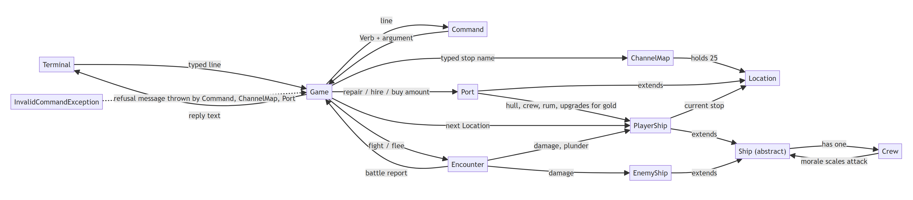

# Eustace the Pirate Monk — Specification

Specification Document - CS 2114 Project 1, Group 87

Marcos's draft. Aidan's draft of the same deliverable is `SPEC.md`; the two designs differ
(this one has the 25-stop Channel map, crew morale and greed, and cannon levels in place of
weapon items). The group picks one at the Tuesday meeting.

Sections 1, 2, 3, 6, 7 and 8 are drafted; sections 4 and 5 are not started.
`SPEC_ASSIGNMENT.md` holds the instructions and the checklist; `DESIGN.md` holds the scope
this builds on.

All code is Java 8 (the lab Eclipse project targets JavaSE-1.8), in the default package
beside the existing `src/` stubs. The design is sized for two entry-level Java programmers
working for two weeks: most classes are 30–80 lines, and the only collection is
`ArrayList`.

---

## 1. Class design

Twelve classes and four enums. The last column names the requirements (FR, from
DESIGN.md §2) and bad-input cases (from DESIGN.md §4) each class answers for, so section 5
can cite them.

| Class | Single job | Scope items |
| --- | --- | --- |
| `Game` | Runs the turn loop: reads a line, has it parsed, checks the command is allowed in the current mode, hands it to the object that carries it out, and ends the run on a win or a loss. Holds `main`. | FR1, FR11, FR12, FR14, FR17; cases 14, 15, 17, 19 |
| `Terminal` | All console input and output: reads lines without crashing on end of input, strips invisible characters, asks yes/no questions, prints text. | FR14; cases 18, 23, 24, 25 |
| `Command` | Turns one typed line into a `Verb` and an argument, and turns an argument into a whole number. | FR13; cases 1–6, 8, 9–11, 27 |
| `InvalidCommandException` | Carries the message the player sees when a command is refused. | every refused case |
| `ChannelMap` | Builds the 25 stops of the Channel map, links them, and finds a stop from the name the player typed. | FR4; cases 7, 20, 26, 27 |
| `Location` | One stop on the map: its name, kind and the stops one move away. | FR2 |
| `Port` | A stop where the ship is moored and can trade: repair, crew, rum and cannon or armour upgrades. | FR5–7; cases 12, 13, 16, 22 |
| `Ship` (abstract) | What every ship has, player or enemy: hull, cannons, armour, gold, rum and a crew, plus the rules for dealing and taking damage. | FR8, FR11 |
| `PlayerShip` | The player's ship: where it is, notoriety, ports visited, repairs and upgrades. | FR1, FR3, FR7, FR12 |
| `EnemyShip` | A ship the player meets, built from its type's base numbers plus the player's notoriety. | FR8, FR10 |
| `Crew` | Head count, morale and greed, and the rules that raise and lower them. | FR6, FR8, FR15–17; case 13 |
| `Encounter` | One meeting with an enemy ship: whether it happens on a move, the fight round by round, fleeing, and plunder. | FR4, FR8–10, FR16, FR17; case 21 |

| Enum | Values | What each value holds |
| --- | --- | --- |
| `Verb` | `LOOK STATUS SAIL REPAIR HIRE BUY BONUS FIGHT FLEE RETIRE HELP QUIT` | its usage line, which `help` prints |
| `GameMode` | `IN_PORT AT_SEA IN_ENCOUNTER` | nothing |
| `LocationKind` | `PORT COASTAL_WATERS SEA_LANE HIGH_SEAS` | its encounter chance |
| `EnemyType` | `MERCHANT PIRATE COAST_GUARD` | base hull, crew, cannons, armour, gold and crew morale, and the notoriety gained for beating it |

The full UML class diagram, with every field and public method, is
[docs/class-diagram.png](docs/class-diagram.png) (source:
[docs/class-diagram.mmd](docs/class-diagram.mmd)). Sections 3 and 4 will copy their fields
and signatures from it.

### What the design uses from the course

- Inheritance and polymorphism in two places. `PlayerShip` and `EnemyShip` extend the
  abstract `Ship` and each override `describe()`; `Port` extends `Location` and overrides
  `describe()` to add its prices.
- A graph: 25 `Location` objects, each holding an `ArrayList` of its neighbours.
- Composition: every `Ship` has a `Crew`; `Game` holds zero or one `Encounter`.
- Enums that carry data: `LocationKind` holds encounter chances and `EnemyType` holds base
  stats, so `Encounter` and `EnemyShip` read numbers without a lookup table.
- A checked custom exception, `InvalidCommandException`, for every refused command.
- A seeded `Random` passed in from `main`, so JUnit tests replay the same fight every run.

### Why the classes are split this way

**Player and enemy ships share `Ship`.** Both have hull, cannons, armour, gold, rum and a
crew, and both fight by the same rules. `Encounter.fight()` calls `attackStrength()` and
`takeDamage(int)` on a `Ship` without checking which side it is. `PlayerShip` adds what
only the player needs: location, notoriety, ports visited, `repair` and the two upgrades.
`EnemyShip`'s constructor reads its `EnemyType` and adds amounts based on the player's
notoriety (section 3.3), so enemies get tougher as the player's name spreads. Merchant
crews start with low morale, so they often surrender before their ship is sunk.

**`Crew` is its own class inside every `Ship`.** `moraleFactor()` scales
`Ship.attackStrength()`, so a crew with high morale deals more damage than the same crew
with low morale.
`Crew.isBroken()` is true when morale reaches 0 or greed reaches 100: a broken enemy crew
surrenders, a broken player crew mutinies and ends the run. Enemy crews never take
plunder, so their greed never changes.

**Rum is cargo, so `Ship` holds the bottle count.** On each move into a sea stop,
`Crew.drink(int bottlesAvailable)` returns how many bottles the men drink (one per ten
men); if the hold has fewer, morale drops instead.

**Morale and greed change only through named events.** `Crew` has no public setter for
either number. `lose` lowers morale for each man lost, `drink` lowers morale when rum runs short, `onWin(int plunder)` raises
morale and raises greed with the plunder, `onFlee()` lowers morale, and
`receiveBonus(int gold)` lowers greed. Each method keeps both numbers between 0 and 100, so
no caller can push them out of range.

**Cannons and armour are levels from 1 to `PlayerShip.MAX_LEVEL`.** `buy cannons` and
`buy armour` raise a level by one. Levels take the place of named weapons and per-port
stock lists, so `buy` only has three fixed items (`cannons`, `armour`, `rum`) and no port
can be out of stock.

**There is no `Merchant` class.** Buying from a shopkeeper uses the prices on `Port`.
Every port charges the same prices, held as constants on `Port`, except that Sark, the
pirate cove, sells rum at half price. A merchant ship the player raids is an `EnemyShip`
whose type is `EnemyType.MERCHANT`.

**`Port` extends `Location`.** A port is a stop on the map with a shop attached. The
subclass keeps the trade methods off the 18 sea stops that have no shop.

**The game mode is computed.** `Game.mode()` returns `IN_ENCOUNTER` when an encounter is in
progress, otherwise `IN_PORT` when the ship's stop is a `PORT`, otherwise `AT_SEA`. No field
stores the mode, so it cannot disagree with where the ship is. Each command handler in
`Game` starts by checking `mode()` and throws if it is wrong: `fight` and `flee` need
`IN_ENCOUNTER` (case 14); `repair`, `hire` and `buy` need `IN_PORT` (case 15); `sail` is
refused during an encounter. This is the state machine noted in DESIGN.md.

**Refusals are exceptions.** Any method that refuses player input throws
`InvalidCommandException` with the player-facing message. `Game.run` catches it, prints the
message and reads the next line. Every method validates before it changes any field, so a
refused command changes nothing.

**Verbs are matched with `Verb.valueOf`.** `Command.parse` lower-cases the line, splits it
on spaces, and strips quotes, periods, commas, exclamation marks and question marks from
both ends of each word, so `SAIL "Dover".` reads as `sail dover` (cases 5 and 6). Minus
signs stay, so `repair -50` still reaches the negative-amount check (case 9). It then
upper-cases the first word and calls `Verb.valueOf`, which throws `IllegalArgumentException` for a word that is not a
verb; `parse` catches that and throws `InvalidCommandException` with the unknown-command
message (case 2). `help` loops over `Verb.values()`, so a new verb appears in `help`
without editing the help text.

**Buying never overflows.** `Port` divides first: the number of units bought is the
smallest of the amount typed, the player's gold divided by the unit price, and the room
left (full hull, `Crew.MAX_COUNT`). The cost is that number times the unit price, which is
never more than the gold the player holds (case 12).

**One `Random` for the whole run.** `Game.main` creates it and passes it to `Game`, which
passes it to `Encounter.roll`, `Encounter.fight` and `Encounter.flee`. A JUnit test seeds
its own `Random`, and forces a fight by building `new Encounter(player, enemy, random)`
directly instead of calling `roll`. `Encounter.roll` returns `null` when no ship appears;
`Game` stores whatever it returns, so `encounter == null` means no fight is in progress.

**Tunable numbers are named constants in the class that uses them**: `Game.GOLD_TARGET`,
the `PlayerShip` starting values and `MAX_LEVEL`, the prices on `Port`, `Crew.MAX_COUNT`
and the morale and greed steps, encounter chances on `LocationKind`, and base stats on
`EnemyType`. The values are still placeholders (DESIGN.md §2).

### 1.1 The Channel map

The map is drawn like a metro map laid over the English Channel. Each stop is a place the
ship can be, and a move goes to a stop joined to the current one by a line. The SVG source
is [docs/channel-map.svg](docs/channel-map.svg).

| Kind | What it is | Stops | Encounter chance per move (placeholder) | Who the ship meets |
| --- | --- | --- | --- | --- |
| `PORT` | Moored in harbour; the only kind where `repair`, `hire` and `buy` work | 7 | 0% | nobody |
| `COASTAL_WATERS` | The sea around one port; every port joins only its own coastal waters | 7 | 15% | coast guard or merchant, even odds |
| `SEA_LANE` | The open water on a direct route between two ports; joins exactly two coastal-waters stops | 8 | 35% | merchant 70%, pirate 30% |
| `HIGH_SEAS` | Mid-Channel water away from any route | 3 | 60% | pirate or merchant, even odds |

The links `ChannelMap.standard()` builds:

- Each port to its coastal waters: Southampton, Winchelsea and Dover (English); Barfleur,
  Dieppe and Boulogne (French); Sark (pirate cove, the home port).
- Each sea lane to the coastal waters of the two ports in its name: Southampton-Winchelsea,
  Winchelsea-Dover, Barfleur-Dieppe, Dieppe-Boulogne, Barfleur-Sark,
  Southampton-Barfleur, Winchelsea-Dieppe, Dover-Boulogne.
- West Channel to off Southampton, off Barfleur, off Sark and Mid Channel.
- Mid Channel to off Winchelsea, off Dieppe and East Channel.
- East Channel to off Dover and off Boulogne.

Each stop has a key with no spaces: the port name (`dover`), `off-` plus the port name
(`off-dover`), the two port names joined by a hyphen (`dover-boulogne`), or the high-seas
name (`west-channel`). `ChannelMap.find` makes two attempts. First it lower-cases the whole
argument, turns spaces into hyphens and looks for a stop with that key; if none matches,
it tries the first word alone. `sail off dover` matches on the first attempt and
`sail dover now please` on the second (case 4). With 25 stops, `find` checks each one in
turn, so the map needs no `HashMap`.

Sailing from Dover to Boulogne takes four moves: `off dover`, `dover boulogne`,
`off boulogne`, `boulogne`. Each move into a sea stop rolls one encounter and makes the
crew drink.

---

## 2. System diagram

Each box is one class from section 1; enums are left out. Each arrow points the way the
labelled thing travels: a typed line, a stop name, an amount of gold, damage. "extends"
arrows point from a subclass to its parent. The source is
[docs/system-diagram.mmd](docs/system-diagram.mmd); after editing it, paste it into
https://mermaid.live and export a new PNG.

One turn through the diagram: `Terminal` hands the typed line to `Game`; `Command` turns it
into a `Verb` and an argument; `Game` checks the mode, then sends the command to
`ChannelMap` and `PlayerShip` for `sail`, to `Port` for `repair`, `hire` and `buy`, or to
`Encounter` for `fight` and `flee`; the text that comes back goes to `Terminal` to print.
A refusal from `Command`, `ChannelMap` or `Port` reaches `Game` as an
`InvalidCommandException`, whose message `Game` prints.

---

## 3. Data & state

Every field is `private`. The numbers in 3.2 are placeholders the group tunes in week 2;
the expected results in section 6 use them, so recompute those results when a number
changes.

### 3.1 Which structures hold the core data

The core data is the map: 25 `Location` objects and the 32 links between them.

- `ChannelMap.stops` is an `ArrayList<Location>` holding all 25 stops in the order
  `standard()` adds them. `find` compares the typed name against each stop's key in turn,
  at most 25 string comparisons per `sail`. The list grows as `standard()` adds stops, so
  nobody has to count them first, which a plain array would need. A `HashMap` would find
  a key in one step, but at 25 stops the saving is too small to notice, and the list
  needs only a loop and `equals`, which both of us already use.
- `Location.neighbours` is an `ArrayList<Location>` of 1–5 stops, an adjacency list. A
  25 × 25 `boolean` table would store 625 entries to record 32 links. The list keeps
  neighbours in the order they were connected, so `look` prints them in the same order on
  every run and a test can check the exact text.
- Gold, rum, notoriety and ports visited are `int` fields: the game needs how many, never
  which ones, so no list is kept. Verbs and enemy types are enums, so `values()` lists them
  without a collection.

### 3.2 Placeholder numbers

| Class | Constant | Value | Meaning |
| --- | --- | --- | --- |
| `Game` | `GOLD_TARGET` | 1000 | gold needed to `retire` |
| `PlayerShip` | `STARTING_HULL` | 100 | also the player's `maxHull` |
| `PlayerShip` | `STARTING_CREW`, `STARTING_CANNONS`, `STARTING_ARMOUR` | 20, 1, 1 | |
| `PlayerShip` | `STARTING_GOLD`, `STARTING_RUM` | 200, 30 | rum in bottles |
| `PlayerShip` | `MAX_LEVEL` | 5 | highest cannon or armour level |
| `Port` | `REPAIR_PRICE`, `HIRE_PRICE`, `RUM_PRICE` | 2, 15, 4 | gold per hull point, per man, per bottle; Sark charges half for rum |
| `Port` | `UPGRADE_PRICE` | 100 | multiplied by the level being bought, so level 2 costs 200 |
| `Crew` | `MAX_COUNT`, `START_MORALE` | 40, 70 | `START_MORALE` is the player's crew only |
| `Crew` | `MORALE_PER_MAN_LOST` | 5 | |
| `Crew` | `DRY_MORALE_LOSS`, `WIN_MORALE`, `FLEE_MORALE_LOSS` | 10, 10, 15 | |
| `Crew` | `GOLD_PER_GREED` | 20 | plundered gold that adds 1 greed |
| `Encounter` | `FLEE_DAMAGE`, `ROLL_RANGE` | 10, 6 | each shot adds `random.nextInt(ROLL_RANGE)`, 0–5 |
| `LocationKind` | encounter chance | `PORT` 0, `COASTAL_WATERS` 15, `SEA_LANE` 35, `HIGH_SEAS` 60 | percent per move |

| `EnemyType` | hull | crew | cannons | armour | gold | morale | notorietyGain |
| --- | --- | --- | --- | --- | --- | --- | --- |
| `MERCHANT` | 40 | 8 | 1 | 0 | 150 | 30 | 1 |
| `PIRATE` | 60 | 15 | 2 | 1 | 100 | 60 | 2 |
| `COAST_GUARD` | 80 | 20 | 3 | 2 | 50 | 80 | 3 |

### 3.3 Fields by class

**`Game`**

| Field | Type | Starts at | Rule |
| --- | --- | --- | --- |
| `terminal` | `Terminal` | constructor argument | `final`, never `null` |
| `map` | `ChannelMap` | constructor argument | `final`, never `null` |
| `player` | `PlayerShip` | a new ship at `map.getHome()` | `final` |
| `encounter` | `Encounter` | `null` | `null` whenever no fight is in progress; set by `sail`, set back to `null` after `fight` or `flee` |
| `random` | `Random` | constructor argument | `final`; the only `Random` in the program |
| `running` | `boolean` | `true` | `false` after retiring, sinking, mutiny or quitting, and never `true` again |

`Game` stores no mode: `mode()` works it out from `encounter` and
`player.getLocation().getKind()` each time it is called (section 1).

**`Terminal`**: `in : Scanner` and `out : PrintStream`, both `final` constructor arguments.
It holds no game state.

**`Command`** (never changes after construction)

| Field | Type | Starts at | Rule |
| --- | --- | --- | --- |
| `verb` | `Verb` | parsed from the first word | `final`, never `null` |
| `argument` | `String` | the rest of the line | `final`; lower case, single spaces between words, quotes and `. , ! ?` stripped from each word's ends; `""` when there is no argument |

**`InvalidCommandException`** has no fields of its own; `Exception` stores the message.
Declare `private static final long serialVersionUID = 1L;` or Eclipse warns on every
`Exception` subclass.

**`Verb`**: `usage : String`, `final`. The usages are `look`, `status`, `sail <stop>`,
`repair <points>`, `hire <men>`, `buy cannons | buy armour | buy rum <bottles>`,
`bonus <gold>`, `fight`, `flee`, `retire`, `help` and `quit`.

**`GameMode`** has no fields.

**`ChannelMap`**

| Field | Type | Starts at | Rule |
| --- | --- | --- | --- |
| `stops` | `ArrayList<Location>` | the 25 stops `standard()` adds | `final`; keys unique; nothing added or removed after `standard()` returns; `standard()` connects links in the order section 1.1 lists them, which fixes the order `look` prints neighbours in |
| `home` | `Port` | Sark | set once in `standard()` |

**`Location`**

| Field | Type | Starts at | Rule |
| --- | --- | --- | --- |
| `key` | `String` | constructor argument | `final`; lower case, no spaces, unique on the map (`off-dover`) |
| `name` | `String` | constructor argument | `final`; what the player reads (`off Dover`) |
| `kind` | `LocationKind` | constructor argument | `final` |
| `neighbours` | `ArrayList<Location>` | empty | 1–5 entries once the map is built; if A lists B then B lists A; never lists itself or one stop twice; `getNeighbours()` returns `Collections.unmodifiableList(neighbours)` |

**`Port`** adds `owner : String`, `final`, exactly `"English"`, `"French"` or `"Pirate"`.
Its `kind` is always `PORT`.

**`LocationKind`**: `encounterPercent : int`, `final`, values in 3.2.

**`Ship`** (both subclasses inherit these)

| Field | Type | Starts at | Rule |
| --- | --- | --- | --- |
| `name` | `String` | constructor argument | `final` |
| `hull` | `int` | `maxHull` | 0 ≤ `hull` ≤ `maxHull` |
| `maxHull` | `int` | constructor argument | `final`, greater than 0 |
| `cannons` | `int` | constructor argument | 1 ≤ `cannons` ≤ `MAX_LEVEL` |
| `armour` | `int` | constructor argument | 0 ≤ `armour` ≤ `MAX_LEVEL` |
| `gold` | `int` | constructor argument | never negative |
| `rum` | `int` | constructor argument | bottles, never negative |
| `crew` | `Crew` | constructor argument | `final`, never `null` |

`PlayerShip` changes `hull`, `cannons` and `armour` through the protected setters
`setHull`, `setCannons` and `setArmour`. Every other change goes through a public method.

**`PlayerShip`**

| Field | Type | Starts at | Rule |
| --- | --- | --- | --- |
| `location` | `Location` | the home port | never `null`; `moveTo` only accepts a neighbour of the current stop |
| `notoriety` | `int` | 0 | never negative; rises by the beaten type's `notorietyGain` |
| `portsVisited` | `int` | 0 | +1 on every arrival at a port, repeat visits included |

**`EnemyShip`** adds `type : EnemyType`, `final`. For player notoriety `n`, the constructor
sets the inherited fields to: `maxHull` = type hull + 2n; crew count = type crew + n/2, at
most `MAX_COUNT`; `cannons` = type cannons + n/10 and `armour` = type armour + n/10, each at
most `MAX_LEVEL`; `gold` = type gold + 5n; `rum` = its crew count; crew morale = type
morale.

**`EnemyType`**: `hull`, `crew`, `cannons`, `armour`, `gold`, `morale` and
`notorietyGain`, all `final int`, values in 3.2.

**`Crew`**

| Field | Type | Starts at | Rule |
| --- | --- | --- | --- |
| `count` | `int` | constructor argument, capped at `MAX_COUNT` | 0 ≤ `count` ≤ `MAX_COUNT` |
| `morale` | `int` | constructor argument, capped at 100 | 0 ≤ `morale` ≤ 100 |
| `greed` | `int` | 0 | 0 ≤ `greed` ≤ 100; only the player's crew ever gains greed |

**`Encounter`**: `player : PlayerShip`, `enemy : EnemyShip` and `random : Random`, all
`final` constructor arguments; `random` is the same object `Game` holds. An `Encounter`
keeps no finished flag, because `Game` drops it by setting `encounter` to `null` as soon as
`fight()` or `flee()` returns.

### 3.4 How the state changes

These are the rules the methods in section 4 carry out.

- Every method that changes `morale` or `greed` keeps it within 0–100, and `count` within
  0–`MAX_COUNT`.
- `Crew.moraleFactor()` = 0.5 + morale ÷ 200.0: 0.5 at morale 0, 1.0 at morale 100.
- `Ship.attackStrength()` = (cannons × 5 + crew count ÷ 2) × `moraleFactor()`, rounded
  down, at least 1. A fresh player ship has (5 + 10) × 0.85 = 12.75, rounded down to 12.
- `Ship.takeDamage(raw)`: damage landed = raw − armour × 2, at least 1 when raw > 0. Hull
  drops by that much, stopping at 0. The crew loses landed ÷ 5 men, and each man lost
  costs `MORALE_PER_MAN_LOST` morale. Returns the hull points lost.
- `Ship.isDefeated()` is true when hull is 0, crew count is 0, or `crew.isBroken()`.
  `Crew.isBroken()` is true when morale is 0 or greed is 100.
- One round of `Encounter.fight()`: the player fires `attackStrength()` +
  `random.nextInt(ROLL_RANGE)` at the enemy; if the enemy is not defeated, it fires back
  the same way. Rounds repeat until one ship is defeated. Every shot lands at least 1
  damage, so every fight ends.
- A win moves the enemy's gold and rum to the player, adds the type's `notorietyGain`, and
  calls `crew.onWin(gold taken)`: morale + `WIN_MORALE`, greed + gold ÷ `GOLD_PER_GREED`.
- `flee()` calls `player.takeDamage(FLEE_DAMAGE)` and then `crew.onFlee()`: morale −
  `FLEE_MORALE_LOSS`.
- Each `sail` into a sea stop: the crew needs (count + 9) ÷ 10 bottles. With enough rum
  it drinks that many; with fewer, it drinks what is left and loses `DRY_MORALE_LOSS`
  morale. Then `Encounter.roll` runs.
- `Encounter.roll`: a ship appears when `random.nextInt(100)` is below the stop's encounter
  chance. A second `random.nextInt(100)` picks its type: in coastal waters, below 50 is the
  coast guard and otherwise a merchant; in a sea lane, below 70 is a merchant and otherwise
  a pirate; on the high seas, below 50 is a pirate and otherwise a merchant. `roll` builds
  the ship with `new EnemyShip(type, player.getNotoriety())`. Code calls
  only `random.nextInt(int)`, so a test `Random` controls every roll.
- `Crew.receiveBonus(gold)`: gold per head = gold ÷ count; greed drops by that amount and
  morale rises by half of it.
- A `Port` sale buys the smallest of the amount typed, gold ÷ price, and the room left
  (hull to `maxHull`, crew to `MAX_COUNT`); cost = units × price.
- `running` becomes `false` when the player retires or quits, or when `player.isDefeated()`
  is true after a `sail`, `fight` or `flee`. A broken crew ends the run as a mutiny; zero
  hull or zero crew ends it as a sinking.

## 4. Method signatures

Not drafted yet. Section 6.2 already lists every public method, so section 4 can reuse its
method column and add the return type and a one-line behaviour taken from 3.4.

## 5. Where validation lives

Not drafted yet. Plan: one row per catching method, listing the case numbers it handles
(`Command.parse` 1–6 and 8, `Command.parseAmount` 9–11, the `Port.sell*` methods 12–13,
`ChannelMap.resolveMove` 7, 20 and 26, and so on), about 9 rows for all 27 cases.

## 6. Test plan

Every public method has a normal case and a bad-input case. A method with no parameters
cannot receive bad input, so its second column tests an edge state instead, marked
**Edge**. Getters share one row per class. Numbers in brackets are the DESIGN.md §4
bad-input cases a row covers; 6.3 maps all 27.

### 6.1 Shared setup

- One JUnit test class per class (`CrewTest`, `PortTest`, …), each extending
  `student.TestCase` from `student.jar`, in the default package beside the code. Being in
  the same package lets a test call the protected setters, as in `setHull(80)`.
- `FixedRandom` is a test-only subclass of `Random` whose `nextInt(int bound)` returns a
  value set in its constructor or by `setValue(int)`. With 0, every encounter roll succeeds,
  the first type in the stop's list is picked, and every shot adds 0. With 99, no encounter
  happens.
- `TestShip` is a test-only subclass of `Ship` with a one-line `describe()`, used to test
  `Ship`'s constructor directly.
- **Fresh player**: `new PlayerShip("Eustace", sark)`, where `sark` is
  `ChannelMap.standard().getHome()`. Hull 100/100, crew 20, morale 70, greed 0, cannons 1,
  armour 1, gold 200, rum 30, at Sark.
- **Fresh game**: `new Game(terminal, ChannelMap.standard(), new FixedRandom(99))`, where
  `terminal` reads from `new Scanner("")` and writes to a `PrintStream` the test can read
  back. Tests reach the ship and the fight through `getPlayer()` and `getEncounter()`.
- **ICE** means the call throws `InvalidCommandException`; **IAE** means it throws
  `IllegalArgumentException`. A refused call leaves every field as it was.

### 6.2 Cases by class

**`Game`**

| Method | Normal case → expected | Bad input or edge state → expected |
| --- | --- | --- |
| `Game(Terminal, ChannelMap, Random)` | fresh game → `mode()` is `IN_PORT`, player at Sark, `isRunning()` true | `null` map → IAE |
| `main(String[])` | not unit-tested; run in Eclipse → the opening scene prints with the ship at Sark | run with arguments `a b` → arguments ignored, same opening |
| `run()` | input `status`, `quit`, `yes` → output holds the status report; `isRunning()` false | input: an empty line, `sial`, then nothing → no output for the empty line, an unknown-command message for `sial`, and `run` returns without an exception (1, 2, 24) |
| `execute(Command)` | one row per verb in the next table | |
| `mode()` | fresh game, `sail off sark` → `AT_SEA` | **Edge**: fresh game with `FixedRandom(0)`, `sail off sark` → `IN_ENCOUNTER` |
| `isRunning()` | fresh game → true | **Edge**: after `execute` of `quit` → false |
| `getPlayer()`, `getEncounter()` | fresh game → a ship at Sark, `null` | no parameters |

**`Game.execute`, one row per verb** (each starts from a fresh game)

| Command | Normal case → expected | Bad input → expected |
| --- | --- | --- |
| `look` | → text holds "Sark", "Pirate" and "off Sark" | `sail off sark`, then `look` three times → `getEncounter()` stays `null`, location unchanged (19) |
| `status` | → text holds "Hull 100/100", "Gold 200" and "Morale 70" | during an encounter → the report prints and the encounter stays (19) |
| `sail` | `sail off sark` → location off Sark, rum 28, no encounter | `sail` → ICE showing `sail <stop>` (3); `sail dover` → ICE naming "off Sark", location unchanged (7) |
| `repair` | `setHull(80)`, `repair 10` → hull 90, gold 180 | `sail off sark`, `repair 10` → ICE saying the ship must be in port (15) |
| `hire` | `hire 5` → crew 25, gold 125 | `hire 2147483647` → crew 33, gold 5 (12) |
| `buy` | `buy rum 20` → rum 50, gold 160 (Sark's half price) | `buy` → ICE showing the `buy` usage (3) |
| `bonus` | `getCrew().onWin(600)` (morale 80, greed 30), `bonus 100` → greed 25, morale 82, gold 100 | `bonus 500` holding 200 gold → ICE, nothing changes |
| `fight` | `sail off sark`, `setValue(0)`, `sail barfleur sark` (a merchant appears), `fight` → merchant surrenders; gold 350, rum 34, no encounter, still running | no encounter, `fight` → ICE saying there is nothing to fight (14) |
| `flee` | same merchant setup, `flee` → hull 92, crew 19, morale 50, no encounter | no encounter, `flee` → ICE (14); same setup with `setHull(5)`, `flee` → not running, text says the ship sank (21) |
| `retire` | `addGold(800)`, `retire` → not running; text shows 1000 gold and 0 ports visited | `addGold(200)`, `retire` → ICE saying 600 more gold is needed; still running (17) |
| `help` | → text holds every `Verb`'s usage | `help sail` → the extra word is ignored, same text (4) |
| `quit` | `execute` of `quit` → not running | through `run()`: `quit`, then `yse` → still running (18) |

**`Terminal`**

| Method | Normal case → expected | Bad input or edge state → expected |
| --- | --- | --- |
| `Terminal(Scanner, PrintStream)` | a scanner over `"look"` → `readLine()` returns `"look"` | `null` scanner → IAE |
| `readLine()` | input `"  sail dover"` followed by a zero-width space → `"sail dover"` (25) | no input left → `null` (24); a 100,000-character line → returned whole, for `Command.parse` to reject (23) |
| `confirm(String)` | input `YES` → true, and the question was printed | input `yse` → false (18); no input left → false |
| `println(String)` | `"hi"` → output `hi` and a line break | `null` → an empty line |

**`Command`**

| Method | Normal case → expected | Bad input or edge state → expected |
| --- | --- | --- |
| `Command(Verb, String)` | `(SAIL, "dover")` → verb `SAIL`, argument `"dover"` | `(null, "dover")` → IAE; `(LOOK, null)` → argument `""` |
| `parse(String)` | `  SAIL   "Dover". ` → verb `SAIL`, argument `"dover"` (5, 6) | spaces and tabs only → `null` (1); `sial` → ICE naming `sial` and pointing to `help` (2); `System.exit(0)` → the same ICE (27) |
| `parseAmount(String)` | `"25"` → 25; `"0"` → 0 (10) | `"-50"` → ICE (9); `"ten"`, `"10.1"` and `"99999999999"` → ICE asking for a whole number (11) |
| `getWord(int)` | argument `"rum 20"`, `getWord(1)` → `"20"` | `getWord(2)` and `getWord(-1)` → `""` |
| `toString()` | `(SAIL, "dover")` → `"sail dover"` | **Edge**: `(LOOK, "")` → `"look"`, no trailing space |
| `getVerb()`, `getArgument()` | return the constructor's values | no parameters |

**Enums and the exception**

| Method | Normal case → expected | Bad input or edge state → expected |
| --- | --- | --- |
| `Verb.getUsage()` | `SAIL` → `"sail <stop>"` | **Edge**: every value in `Verb.values()` has a non-empty usage |
| `LocationKind.getEncounterPercent()` | `SEA_LANE` → 35 | **Edge**: `PORT` → 0 |
| `EnemyType` getters | `MERCHANT` → hull 40, notoriety gain 1 | **Edge**: `COAST_GUARD` → notoriety gain 3 |
| `InvalidCommandException(String)` | `"no such place"` → `getMessage()` returns it | `null` message → `getMessage()` returns `null` |

`GameMode` has no methods of its own.

**`ChannelMap`**

| Method | Normal case → expected | Bad input or edge state → expected |
| --- | --- | --- |
| `standard()` | → 25 stops; home key `"sark"`; whenever A lists B, B lists A | **Edge**: every stop has 1–5 neighbours and no two stops share a key |
| `add(Location)` | a new stop → `find` returns it by its key | a second stop keyed `dover` → IAE; `null` → IAE |
| `connect(String, String)` | after adding Dover and off Dover, `("dover", "off-dover")` → each lists the other | `("dover", "atlantis")` → IAE |
| `find(String)` | `"off dover"` → off Dover; `"dover now please"` → Dover (4) | `"atlantis"`, `"help"` and `"dövér"` → ICE saying there is no such place (8, 26) |
| `resolveMove(Location, String)` | from off Dover, `"dover"` → Dover | from Sark, `"dover"` → ICE naming "off Sark" (7); from Sark, `"sark"` → ICE saying the ship is already there (20) |
| `getHome()` | → Sark, kind `PORT` | **Edge**: owner `"Pirate"` |

**`Location`**

| Method | Normal case → expected | Bad input or edge state → expected |
| --- | --- | --- |
| `Location(String, String, LocationKind)` | `("off-dover", "off Dover", COASTAL_WATERS)` → fields set, no neighbours | `null` or `""` key → IAE |
| `connect(Location)` | `a.connect(b)` → each lists the other | `a.connect(a)` → IAE; connecting `a` and `b` twice → each lists the other once |
| `isNextTo(Location)` | after `a.connect(b)`, `a.isNextTo(b)` → true | `null` → false; an unconnected stop → false |
| `getNeighbours()` | off Dover on the standard map → Dover, Winchelsea-Dover, Dover-Boulogne, East Channel, in that order | **Edge**: calling `add` on the returned list → `UnsupportedOperationException` |
| `getKey()`, `getName()`, `getKind()` | return the constructor's values | no parameters |
| `describe()` | off Dover → text holds "off Dover", "coastal waters" and all four neighbour names | **Edge**: the Dover-Boulogne lane, which has two neighbours → lists exactly two names |

**`Port`** (each row uses a fresh player; `Port` does not check where the ship is, because
`Game` only calls it for the port the ship is moored at)

| Method | Normal case → expected | Bad input or edge state → expected |
| --- | --- | --- |
| `Port(String, String, String)` | `("dover", "Dover", "English")` → kind `PORT`, owner `"English"` | owner `"Spanish"` → IAE |
| `getOwner()` | Dover → `"English"` | no parameters |
| `rumPrice()` | Dover → 4 | **Edge**: Sark → 2 |
| `sellRepair(PlayerShip, int)` | Dover, `setHull(80)`, 10 → returns 10; hull 90, gold 180 | 50 with hull 80 → returns 20; hull 100, gold 160 (13); hull already full → ICE; −5 → IAE |
| `sellCrew(PlayerShip, int)` | Dover, 5 → returns 5; crew 25, gold 125 | 2147483647 → returns 13; crew 33, gold 5 (12, 13) |
| `sellRum(PlayerShip, int)` | Dover, 20 → returns 20; rum 50, gold 120 | `spendGold(197)` so 3 gold is left, then 20 → ICE, rum unchanged; 0 → returns 0, nothing changes (10) |
| `sellUpgrade(PlayerShip, String)` | Dover, `"cannons"` → returns 2; cannons 2, gold 0 | `"spyglass"` → ICE listing cannons, armour and rum (16); `setCannons(5)`, `"cannons"` → ICE, gold unchanged (22) |
| `describe()` | Dover → text holds "Dover", "English" and the repair, crew and rum prices | **Edge**: Sark → rum shown at 2 gold |

**`Ship`** (abstract, so tested through `PlayerShip` or `TestShip`)

| Method | Normal case → expected | Bad input or edge state → expected |
| --- | --- | --- |
| `Ship(...)` | `TestShip` with maxHull 40 → hull 40 | maxHull 0 → IAE; `null` crew → IAE |
| `attackStrength()` | fresh player → 12 | **Edge**: `TestShip` with cannons 1 and `new Crew(20, 0)` → 7 |
| `takeDamage(int)` | fresh player, 12 → returns 10; hull 90, crew 18, morale 60 | −5 → IAE; 0 → returns 0, nothing changes; 500 → returns 100, hull 0 |
| `isDefeated()` | fresh player → false | **Edge**: `setHull(0)` → true; a crew with morale 0 → true |
| `addGold(int)` | 50 → gold 250 | −1 → IAE |
| `spendGold(int)` | 50 → gold 150 | 500 while holding 200 → IAE, gold stays 200 |
| `addRum(int)` | 10 → rum 40 | −1 → IAE |
| `takeRum(int)` | 5 → returns 5, rum 25 | 50 while holding 30 → returns 30, rum 0; −1 → IAE |
| `setHull`, `setCannons`, `setArmour` (protected) | `setHull(80)` → hull 80 | `setHull(150)` with maxHull 100 → IAE; `setCannons(6)` → IAE |
| `getCrew()` and other getters | fresh player → crew count 20 | no parameters |

**`PlayerShip`**

| Method | Normal case → expected | Bad input or edge state → expected |
| --- | --- | --- |
| `PlayerShip(String, Port)` | `("Eustace", sark)` → the fresh-player values; notoriety 0, ports visited 0 | `null` port → IAE |
| `moveTo(Location)` | Sark → off Sark → Sark → at Sark, ports visited 1 | from Sark to Dover → IAE, location unchanged |
| `repair(int)` | `setHull(80)`, 10 → returns 10, hull 90 | 50 with hull 80 → returns 20, hull 100; −1 → IAE |
| `upgradeCannons()` | → returns 2, cannons 2 | **Edge**: at `MAX_LEVEL` → `IllegalStateException`, cannons stay 5 |
| `upgradeArmour()` | → returns 2, armour 2 | **Edge**: at `MAX_LEVEL` → `IllegalStateException`, armour stays 5 |
| `addNotoriety(int)` | 2 → notoriety 2 | −1 → IAE |
| `getLocation()`, `getNotoriety()`, `getPortsVisited()` | fresh player → Sark, 0, 0 | no parameters |
| `describe()` | fresh player → text holds hull 100/100, crew 20, morale 70, greed 0, cannons 1, armour 1, rum 30, gold 200, notoriety 0 | **Edge**: `setHull(0)` → text holds hull 0/100 |

**`EnemyShip`**

| Method | Normal case → expected | Bad input or edge state → expected |
| --- | --- | --- |
| `EnemyShip(EnemyType, int)` | `(MERCHANT, 0)` → hull 40, crew 8, cannons 1, armour 0, gold 150, rum 8, morale 30; `(MERCHANT, 10)` → hull 60, crew 13, cannons 2, armour 1, gold 200 | `(PIRATE, -1)` → IAE; `(null, 0)` → IAE |
| `getType()` | `(PIRATE, 0)` → `PIRATE` | no parameters |
| `describe()` | `(MERCHANT, 0)` → text holds "merchant", hull 40 and crew 8 | **Edge**: `(COAST_GUARD, 0)` → text holds "coast guard" with a space |

**`Crew`**

| Method | Normal case → expected | Bad input or edge state → expected |
| --- | --- | --- |
| `Crew(int, int)` | `(20, 70)` → count 20, morale 70, greed 0 | `(-1, 70)` → IAE; `(50, 70)` → count 40; `(20, 150)` → morale 100 |
| `lose(int)` | `(20, 70)`, 2 → returns 2; count 18, morale 60 | 25 → returns 20; count 0, morale 0; −1 → IAE |
| `hire(int)` | `(20, 70)`, 5 → returns 5, count 25 | 30 → returns 20, count 40 (13); −1 → IAE |
| `moraleFactor()` | morale 70 → 0.85 | **Edge**: morale 0 → 0.5; morale 100 → 1.0 |
| `drink(int)` | `(20, 70)` with 30 bottles → returns 2, morale 70 | 1 bottle → returns 1, morale 60; −1 → IAE |
| `onWin(int)` | `(20, 70)`, 150 → morale 80, greed 7 | 5000 → greed 100 and `isBroken()` true; −5 → IAE |
| `onFlee()` | `(20, 70)` → morale 55 | **Edge**: `(20, 10)` → morale 0, `isBroken()` true |
| `receiveBonus(int)` | `(20, 70)` after `onWin(600)` (morale 80, greed 30), 100 → greed 25, morale 82 | 10 for 20 men (0 per head) → nothing changes; −10 → IAE |
| `isBroken()` | `(20, 70)` → false | **Edge**: `(20, 0)` → true |
| `getCount()`, `getMorale()`, `getGreed()` | `(20, 70)` → 20, 70, 0 | no parameters |

**`Encounter`**

| Method | Normal case → expected | Bad input or edge state → expected |
| --- | --- | --- |
| `Encounter(PlayerShip, EnemyShip, Random)` | fresh player, a merchant, `FixedRandom(0)` → `getEnemy()` is that merchant | `null` enemy → IAE |
| `roll(Location, PlayerShip, Random)` | a sea lane, `FixedRandom(0)` → an encounter with a merchant | a port with `FixedRandom(0)` → `null`; high seas with `FixedRandom(99)` → `null`; `null` location → IAE |
| `fight()` | fresh player vs `EnemyShip(MERCHANT, 0)`, `FixedRandom(0)` → the merchant's crew surrenders in round 3; player hull 97, gold 350, rum 38, notoriety 1, morale 80, greed 7 | **Edge**: `setHull(5)`, vs `EnemyShip(PIRATE, 0)` → the player sinks in round 1; gold stays 200 and the report says the ship went down |
| `flee()` | fresh player vs a merchant → hull 92, crew 19, morale 50, gold 200 | **Edge**: `setHull(5)` → hull 0, `isDefeated()` true (21) |
| `getEnemy()` | returns the enemy passed in | no parameters |
| `describe()` | vs `EnemyShip(PIRATE, 0)` → text holds "pirate" and hull 60 | **Edge**: vs `EnemyShip(COAST_GUARD, 0)` → text holds "coast guard" |

### 6.3 Bad-input cases covered

| Case | Tested in | Case | Tested in |
| --- | --- | --- | --- |
| 1 | `Command.parse`, `Game.run` | 15 | `Game.execute` `repair` |
| 2 | `Command.parse`, `Game.run` | 16 | `Port.sellUpgrade` |
| 3 | `Game.execute` `sail`, `buy` | 17 | `Game.execute` `retire` |
| 4 | `ChannelMap.find`, `Game.execute` `help` | 18 | `Terminal.confirm`, `Game.execute` `quit` |
| 5 | `Command.parse` | 19 | `Game.execute` `look`, `status` |
| 6 | `Command.parse` | 20 | `ChannelMap.resolveMove` |
| 7 | `ChannelMap.resolveMove`, `Game.execute` `sail` | 21 | `Encounter.flee`, `Game.execute` `flee` |
| 8 | `ChannelMap.find` | 22 | `Port.sellUpgrade` |
| 9 | `Command.parseAmount` | 23 | `Terminal.readLine` |
| 10 | `Command.parseAmount`, `Port.sellRum` | 24 | `Terminal.readLine`, `Game.run` |
| 11 | `Command.parseAmount` | 25 | `Terminal.readLine` |
| 12 | `Port.sellCrew`, `Game.execute` `hire` | 26 | `ChannelMap.find` |
| 13 | `Port.sellRepair`, `Port.sellCrew`, `Crew.hire` | 27 | `Command.parse` |
| 14 | `Game.execute` `fight`, `flee` | | |

---

## 7. Division of work

Proposed from the roles in DESIGN.md §5 (Marcos on geography, Aidan on class outlines).
Confirm at the Tuesday 7pm meeting.

| Person | Owns |
| --- | --- |
| Marcos | `Game`, `ChannelMap`, `Location`, `Port`, `LocationKind` |
| Aidan | `Ship`, `PlayerShip`, `EnemyShip`, `EnemyType`, `Crew`, `Encounter`, `Command`, `Verb`, `GameMode`, `Terminal`, `InvalidCommandException` |

**Build order.**

1. First meeting, together: create every class with the signatures in
   `docs/class-diagram.mmd` and bodies that return a default (`0`, `null`, `""`). The
   project compiles from day one, and each person edits only their own files.
2. Week 1: Aidan finishes `Command`, `Terminal`, `Ship`, `Crew` and their tests; Marcos
   finishes `Location`, `Port`, `ChannelMap` and the `Game` loop. Milestone for the second
   Tuesday meeting: start at Sark, `look`, `status`, `sail` round all 25 stops, `repair`,
   `hire` and `buy` in port, `help` and `quit`.
3. Week 2: Aidan finishes `EnemyShip` and `Encounter` with seeded-`Random` tests; Marcos
   wires `fight`, `flee`, `bonus` and `retire` into `Game` and handles mutiny and sinking.
   Both play the game to set the placeholder numbers.

**Integrating.** `Game` is the only class that calls into both people's code, and Marcos
owns it, so two people never edit the same file. Each person pushes to `main` only when the
project compiles and their own JUnit tests pass.

**If time runs short, cut in this order.** Each cut removes one feature and leaves the
rest of the design unchanged; move the cut item back into stretch goal 3.

1. Greed and `bonus`: delete the greed field, `Crew.receiveBonus` and `Verb.BONUS`, and
   the greed line in `Crew.onWin`. Morale still drives combat and mutiny.
2. Rum: delete `Ship.rum`, `Crew.drink` and `buy rum`; morale drops a fixed amount on each
   sea move instead.
3. Coastal waters: delete those seven stops from `ChannelMap.standard()` and link each
   port straight to its lanes and high seas. No class changes, and a crossing drops from
   four moves to two. Also remove the coastal-waters circles from `docs/channel-map.svg`,
   re-export the PNG, and delete kind 2 from the map list in DESIGN.md.

---

## 8. Revised scope

Changes this draft makes to DESIGN.md. "GenAI draft" marks choices Claude made while
drafting; the group should confirm or replace each one.

| Change | Why | Origin |
| --- | --- | --- |
| The port map became a 25-stop metro map with four kinds of stop (port, coastal waters, sea lane, high seas). FR2, FR4 and cases 7 and 20 now say "stop" where they said "port". | Each stretch of water gets its own encounter chance, so the route a player picks changes the risk. | Marcos |
| `sail` moves one stop per command, docking included. | With water stops between ports, "sail to a port" would need route-finding across several stops; one stop per command needs neither route-finding nor a `dock` verb. | GenAI draft |
| Each `Location` keeps a list of its neighbours, and `ChannelMap` finds a stop by checking all 25 in turn. | Closes the DESIGN.md §5 unknown about how to code the port map, using only `ArrayList`. | Aidan (DESIGN.md §5); scan instead of `HashMap`: GenAI draft |
| A basic version of crew morale, greed and rum moved from stretch goal 3 into the MVP: FR3, FR8 and FR16 changed, FR15–17 added. The full version (heavier drinking after big hauls, warnings, a rum hold limit, a `crew` report) stays in stretch goal 3. | Crews on both sides fight better or worse depending on morale. | Marcos; basic/full split: GenAI draft |
| `bonus <amount>` added; `status` prints morale and greed instead of a separate `crew` command. | `bonus` is the only way to lower greed. | GenAI draft |
| Player and enemy ships share an abstract `Ship`. | Both carry hull, crew, gold and rum and fight by the same rules. | Marcos asked for a shared base if it kept the code simple; GenAI draft chose inheritance |
| Named weapons and armour with per-port stock became cannon and armour levels that every port sells. FR1, FR3, FR7 and cases 16 and 22 rewritten. | Removes an `Equipment` class, a slot enum and seven stock lists, so `buy` has three fixed items. | GenAI draft, after Marcos asked for a design two entry-level programmers can finish in two weeks |
| Every port charges the same prices, except rum at half price in Sark. | One set of constants on `Port` replaces a price table per port. | GenAI draft; cheap cove rum from DESIGN.md stretch goal 3 |
| Case 12 now divides before multiplying. The scope doc's approach (`Math.multiplyExact`, recomputing in `long` on overflow) is dropped. | The product can never exceed the player's gold, so there is no exception to handle. | GenAI draft |
| Game modes are computed by `Game.mode()`, and each command handler checks the mode first. | Closes the DESIGN.md §5 unknown about restricting commands by mode. | GenAI draft, from the "state machine" note in DESIGN.md |
| The kind of stop decides which enemy appears; English and French waters are no longer treated differently. | Nations had no effect on rules in the MVP; the politics stretch goal can add them back. | GenAI draft |
| Ports picked: Southampton, Winchelsea, Dover, Barfleur, Dieppe, Boulogne, with Sark as the home cove. | DESIGN.md §3 has Eustace holding the Channel Islands; Sark is one of them. | GenAI draft |
